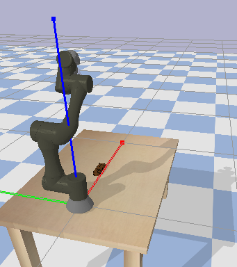
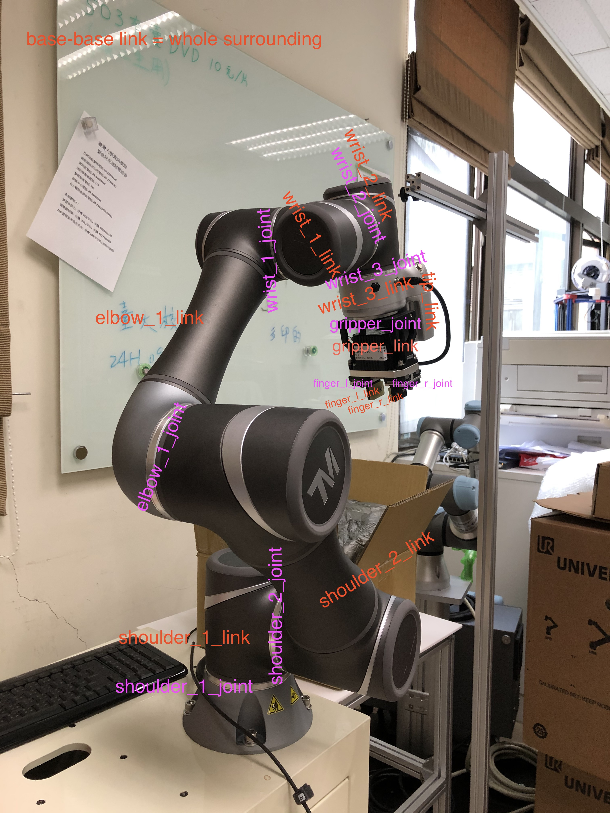

# NSC Short Project on Robotic Grasping with Reinforcement Learning 

This is a short research project conducted in cooperation with the MiRA Lab at National Taiwan University. The goal was to create a simulation for their robotic arm in pybullet and train it to grasp with reinforcement learning. This repository contains the urdf files for the robotic grasper, it's controller and two Gym environments to which Reinforcement Learning algrotihms can be applied. Furthermore it contains the code to train the grasper with RL algorithms such as DQN and DDGP, as well as the evaluation and testing. 

The Simulation            |  The Real Robot
:-------------------------:|:-------------------------:
  |  


## Using the code


 


The code for the controller and the Gym environments is based on the example code provided by Bullet3 for the Kuka Arm (Links can be found in the comments). 

In order to reproduce the code, please install the following packages, ideally in a separate virtual environment. 

1. Install Pybullet via 

```
pip install pybullet

```

2. Install stable-baselines (described here: https://stable-baselines.readthedocs.io/en/master/guide/install.html) Make sure you install it alongside tensorflow 1.x


3. Clone this reppository

```
git clone https://github.com/huetufemchopf/roboticgrasper.git
```

In order to see an example for successful grasping, please run the following code:

4. To train a model, try for example this:

```

python baselines/train_tm700_cam_grasping.py --gym_env 'rgbd' --algorithm 'DQN' --discrete True --lr 0.0001

```

4. Run the following command to play a pretrained model 

```
python baselines/replay_grasping_possensor.py  --gym_env 'rgbd'

```


---


